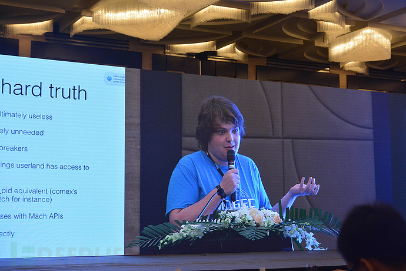
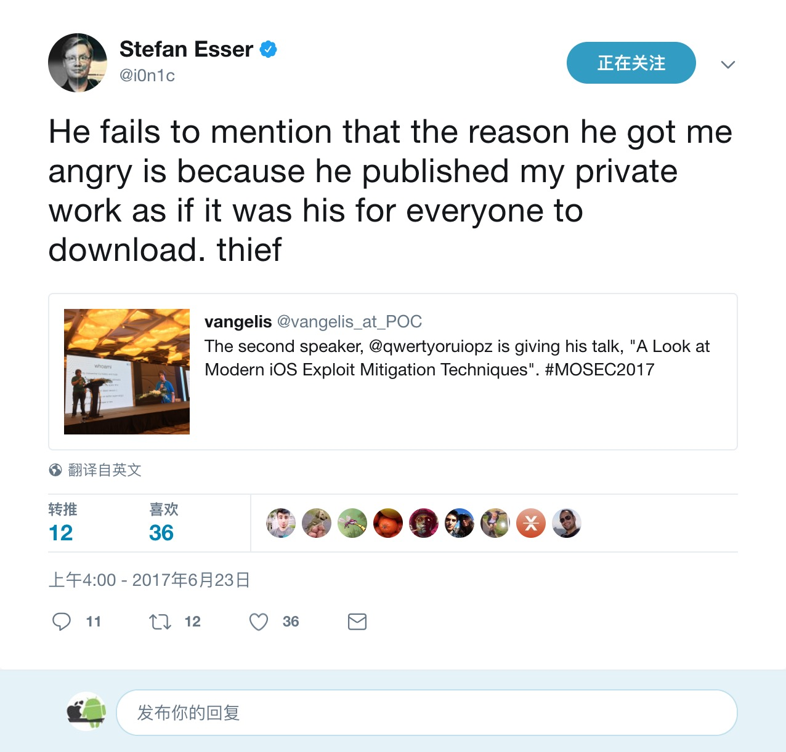
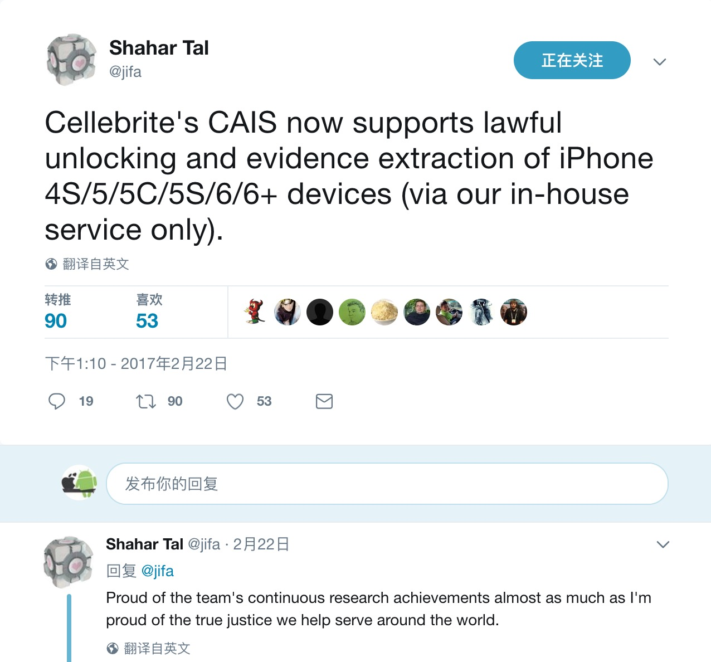

# MOSEC-2017

第三届 MOSEC 移动安全技术峰会参会分享

简单介绍下背景，**MOSEC** 是盘古团队和 **POC** 主办的移动安全技术峰会，到今年已经是第三届，虽然从影响力来看，不如一些重量级的黑客大会，比如 **Black Hat** 和 **DEFCon**，但是从这三届大会的参会者的反馈来看，会议的议题的质量都不错，聚焦移动安全领域前沿性的技术议题及发展趋势，再来看主办方，盘古实验室，相信大家都不陌生，是国内首个自主实现 iOS 完美越狱的团队，也是全球范围内第一个实现针对 iOS 8 和 iOS 9 系统完美越狱的团队。在主流操作系统和重要应用程序中曾发现过数百个0day安全漏洞，也多次在全球顶尖安全会议上分享，如 **Black Hat**, **Syscan** 等，**POC** 是韩国最大的安全技术峰会， 最初是2006年一群韩国黑客与安全研究专家决定以“交流技术、分享知识”为目的举办会议，并将其命名为 **POC**(Power of Community，社区力量)，它是目前互联网安全界举办历史最悠久的大会之一。再来看看会议议程，这届 **MOSEC** 盘古团队没有参与议题分享，只有主持人王铁磊是盘古团队的，王铁磊在去年 **Black Hat USA** 对盘古9实现的技术做过分享。本次与 iOS 平台相关的议题主要有三场，分别是上午的第二场议题：现代iOS系统溢出缓解机制，Speaker 是一位来自意大利年仅20岁的安全研究人员 Luca，喜欢破解各种设备，越狱工具 Yalu 的作者；下午的议题有 Lookout 公司的安全研究员 Max Bazaliy 带来的 Apple Watch 的越狱，Max Bazaliy 在 **Black Hat**、**DEFCon** 大会上进行过多次分享。最后一场也是重量级的嘉宾，是科恩实验室的安全研究员陈良，分享的议题是 iOS 10 内核安全漫谈。

## Presentation

* Revisiting the Kernel Security Enhancements in iOS 10——Liang Chen [Keynote](Keynote/Revisiting%20the%20Kernel%20Security%20Enhancements%20in%20iOS%2010.key) [PDF](Keynote/Revisiting%20the%20Kernel%20Security%20Enhancements%20in%20iOS%2010.pdf)
* A Look at Modern iOS Exploit Mitigation Techniques——Luca Todesco [Keynote](Keynote/A%20Look%20at%20Modern%20iOS%20Exploit%20Mitigation%20Techniques.key)
[PDF](Keynote/A%20Look%20at%20Modern%20iOS%20Exploit%20Mitigation%20Techniques.pdf)
* Android 应用签名的枷锁与革新——韦韬 张煜龙 [Keynote](Keynote/Android%20应用签名的枷锁与革新.key) [PDF](Keynote/Android%20应用签名的枷锁与革新.pdf)

## Resources

* [KeenLab's MOSEC 2017 iOS 10 Kernel Security Presentation is Now UP!
](https://www.youtube.com/watch?v=yfPnryjq12M&feature=youtu.be&a)

## 致辞

这次 MOSEC 的主持人是王铁磊，关注 iOS 越狱领域的读者对他应该都不会陌生，他是盘古团队的首席科学家，还是上海犇众信息技术有限公司的联合创始人，多次在Blackhat、CanSecWest、PoC、XCon等业界安全峰会报告。

### 360
接下来是360的首席安全官谭晓生发言，介绍安全会议，办成精品会议，干货满满，希望与会嘉宾有所收获，网络安全火爆，也遇到很大的挑战，安全首先是要为业务服务，会遇到业务发展和安全的一个权衡。网络安全市场不到400亿，启明星辰20亿，不是一个爆发暴富的行业，沉浸在安全技术方向，网络安全攻防失衡，一家公司一个团队没有办法解决网络安全遇到的问题。

## Android应用签名的枷锁与革新

百度安全实验室，百度首席安全 Android 签名的痛，苦和未来，

### QA

百度以前签名是交由各产线管理，现在准备收回安全管理部门通过 **OASP** 平台进行管理。

## 现代iOS系统溢出缓解机制

第二场议题是由年仅20岁的意大利天才黑客，Yalu 的作者 Luca Todesco 带来的现代iOS系统溢出缓解机制。

开场 Luca 简单介绍了自己，喜欢做安全研究相关的工作，在几个公开的 iOS 越狱工具都做了贡献，闲暇时间私下会越狱相关，包括最新版本 iOS 和 PS4。此外还提及他曾在 Twitter 上惹怒了一个德国人，他口中的德国人就是 Stefan Esser‏。

Luca 介绍了 iOS 史前时期的安全机制，iPhone OS 1.0所有都在 root 权限下运行，没有代码签名和沙箱。通过混淆来加密 OS 镜像文件。在 iOS 5出现了用户态的 ASLR，iOS 6出现内核态的 ASLR，并且区分了用户和内核的地址空间。其中大部分的防护机制都是基于沙盒的。

现代 iOS 安全方面，有些利用缓解策略已经实现了，iOS 10 在安全方面取得胜利，比如对堆采取了一些强化措施来避免 zone confusion 和错误使用 kfree 的攻击。事实是：Apple 并没有主动推出利用缓解，他们只是等 Ian Beer 放出新的利用，然后做一些小的改动来使利用变得没什么作用。

### Code Integrity

#### Kernel

在内核层面，Apple 在 iOS 9 上首次启用了 KPP(Kernel Patch Protection)，不过仅限在 arm64 机器上，这是因为 KPP 需要借助64位机器上的安全芯片来实现。TrustZone 在 iOS 的具体实现，被非官方的称为 WatchTower，更通常的叫法是 KPP。iPhone 7使用硬件加强了保护，错误的被称为 AMCC，据传正确的名字应该是"SiDP"。

#### WebKit

JIT(Just-in-time)即时编译对于高效执行 JavaScript 代码是必要的，这种代码签名正常过于宽松，JIT 编译器会生成新的和未签名的代码。假设一名攻击者可以管理一个"write-anywhere"的攻击，那么也就意味着他能够执行任意代码。存储区被标记为读、写和执行权限，区分权限的方式可以有效杜绝利用数据区域执行代码的攻击，在 iOS 10 中 Apple 将编译 JavaScript 放在仅允许执行的存储区之中。任何进程都无法从这个区域读取和写入数据。

### Data Protection

Secure Enclave 是 Apple A7(iPhone 5s 使用的处理器)或更高版本 A 系列处理器中集成的协处理器。它是独立的安全加密模块，每个 Secure Enclave 在制造过程中都预置了 UID（唯一 ID），这个 ID 无法从系统的其他部分访问，而且就连 Apple 也没办法获取。

主要用于处理指纹相关的数据，保证用户的指纹信息不被任何第三方窃取。工作原理大致是 Secure Enclave 接收到来自 Touch ID 传感器的指纹数据，确认是否匹配，处理器和 Touch ID 传感器之间的通信通过串行外围接口总线实现。处理器将数据转发到 Secure Enclave，但处理器本身无法读取这些数据。

### The cold，hard truth

所有的安全策略最终都是无用的，"Bulletproof JIT" 可能是最好的缓解措施，尽管它现在没用，但是未来会比 KPP 更有意义。Secure Enclave 会使得加大攻击者的攻击成本，然而，以色列的移动设备取证公司 Cellebrite 已经支持 iPhone 设备的解锁和取证。

### Attacks

#### WatchTower

### QA

没有问题

## 天空之城－飞控安全攻防剖析

### QA

没有问题

## Pwning苹果手表

### QA

没有问题

## 伤痕累累的Android Wi-Fi驱动 - 从本地提权到远程攻击

### QA

Q:没太听清楚，提问者问了大概是代码中的漏洞需不需通过一个工具来检测

A:不需要，基本上从代码审计的层面就可以发现出来

## 幻象之盒

### QA

没有问题

## iOS 10内核安全漫谈

会议开始时陈良提到虽然他曾做过多次 iOS 内核相关的分享，但本次是他第一次分享 iOS 10 内核安全。

### Last year in iOS 10

2016年12月12日 iOS 10.2 发布，Google Project Zero 的 Ian Beer 在12月中旬发布 mach\_portal 利用，整个攻击链由三个漏洞组成，mach\_portal 利用的漏洞都源于 XNU 内核对 Mach Port 的处理不当，这也是 mach_portal 名称的由来。
Project Zero 是 Google 在2014年7月15日公开的一个信息安全团队，此团队专责找出各种软件的安全漏洞，特别是可能会导致0Day攻击者，他们找出安全漏洞之后，会即时通知受影响软件的开发者，在开发者还没修补此漏洞前，不会对外公布。但90天之后，无论原开发者是否已修复漏洞，都会自动公开。

Luca 发布了 iOS 10.1.1 的越狱工具，被称为“Yalu + mach\_portal”，就是基于前面提到的 Ian Beer 发现的 mach\_portal 攻击链，包含了iPhone 7 中绕过 AMCC，AMCC 据推测是 Apple Memory C…bla Controller 的简称，也有传言说正确的名字应该是”SiDP"。中间 C 不大清楚代表什么，是 iPhone 7 新引入的硬件保护机制，可以从硬件层面保证页不被篡改。
随后 Luca 和 Marco Grassi 在17年1月26号发布了半完美越狱工具 Yalu102。
17年3月27号 iOS 10.3 发布，从那儿以后，好像一切都风平浪静了。
问题：今年发生了什么？

### Agenda

接下来会从漏洞、机制、利用缓解三个方面漫谈iOS内核安全, 最后会进行总结。

### Vulnerability

#### Begin with Pangu 9.3.3…

先从盘古9.3.3开始说，漏洞的 CVE ID 是 CVE-2016-4654,简单介绍下 CVE，CVE 全称“Common Vulnerabilities&Exposures” 公共漏洞和暴露。CVE 为广泛认同或者已经暴露出来的信息安全漏洞的给出一个公共的名称，可以帮助用户在各个独立漏洞数据库中和漏洞评估工具中共享数据。如果有 CVE 的名称，就可以快速的在其他任何 CVE 兼容的数据库中找到对应的修补信息，方便解决安全问题。命名都会以 CVE 作为前缀，中间是年份，比如上面这个漏洞就是在2016年公开的，最后是4位的随机数，没有任何其他含义，只是一个编号，当数字全部用光后，可以增加数字的位数。
`IOMobileFrameBuffer` 是处理屏幕帧缓存的内核扩展，⽤户态通过**IOMobileFramebuffer.framework** 框架来控制，最终会调⽤ `IOMobileFramebuffer::swap_submit` 触发漏洞，`IOMFBSwap` 数据是用户可控（⽤户态传⼊），循环中没有检查 `v33` 长度，赋值 `v34` 的时候发⽣堆溢出。

#### CVE-2016-4654: the fix

iOS 10.0 beta 2 中修复了这个漏洞，修法是限制 someCount 不超过4，我们可以得出结论，在 iOS 10.0.1发布前夕，Apple 对 iOS 9 的代码做了严格的代码审计，另外有几个没修复的洞在 iOS 10 beta 中也被封堵了。

#### XNU case: CVE-2017-2370

CVE-2017-2370，科恩实验室的 Marco Grassi 发现的，运气很差，和随后 Ian Beer 的发现撞洞了。args->recipe_size 是用户态的指针，在下面使用了 args->recipe_size，会出现堆溢出。

#### CVE-2017-2370: the fix

在 iOS 10.2.1修复了这个漏洞，我们可以得到的启示是：新上的接口或者功能往往更可能出现漏洞，这个和我们应用层开发类似。

### Mechanism

#### Story of OSNumber: From Pegasus

16年有段时间最火的漏洞当属阿联酋的人权活动人士被 APT 攻击所使用的 iOS **PEGASUS**（又称 **Trident** 三叉戟）0day漏洞。是 iOS 历史上最严重的漏洞，为了修复该漏洞，苹果专门发布了一个 iOS 9.3.5 的版本。更新日志只有简单的一句：提供了重要的安全性更新，推荐所有用户安装。这个漏洞的厉害之处在于可以直接从沙盒内对内核进行攻击(无需沙盒逃逸)，并且同时影响 iOS(9.3.4)和 OS X (10.11.6)。
三叉戟实际上是由三个漏洞组成，三个漏洞都属于0day漏洞，也就是说这些漏洞在被修复之前，除了漏洞的发现者，其他人都不知道这个漏洞的存在。CVE-2016-4655 就是其中之一，他是内核信息泄露漏洞，可用于绕过 KASLR。

`OSUnserializeXML` 接收用户态传入的复杂数据将其反序列化成内核基本数据结构（例如`OSDictionary`，`OSArray`等）, 很多 `IOKit` 的 API 函数都调用了他。

`OSUnserializeXML` 接受两种形式的XML data，分别为 Binary 模式和 XML 模式。

#### Story of OSNumber: CVE-2016-4655 details

当使用二进制模式的时候，会调用 `OSUnserializeBinary` 解析数据，`OSUnserializeBinary` 是新添加的功能，它的作用和 `OSUnserializeXML` 一模一样，但是这种格式处理是不同的。`OSUnserializeBinary` 转化一个二进制格式为基本内核数据对象。我们观察 `OSNumber` 对象的创建代码，代码标注的位置可以看到 `len` 是用户可控，而 `value` 是 `unsigned long long` 类型，也就是最大64位。

查看 `OSNumber` 的 C++ 代码可以发现 `len` 其实对应的含义是 `newNumberOfBits`，也就是数据的位数。数据位数应该不超过64，然而整个初始化过程中没有任何额外的检查。

那么究竟是怎么出现泄漏的呢？可以发现 `is_io_registry_entry_get_property_bytes` 中通过 `numberOfBytes` 函数确认`OSNumber` 的数据长度，最终造成内核栈数据读取的漏洞。而内核栈上保存了函数调用地址以及 `stack cookie` 等数据，可以轻易计算出内核的基地址。

#### CVE-2016-4655: the fix

在 iOS 10.0.1 中进行了修补，分析 iOS 10.1.1 的内核可以发现 Apple 在创建 `OSNumber` 之前会对参数做校验，很明显这不是标准的修法，但是似乎对于 iOS 来说，这种修法就足够了。

#### OSNumber: any more problems

还有问题吗？之前提到，`OSUnserializeXML` 接受两种形式的 XML data…
前面提到二进制模式已经被修复，那么 XML 模式呢？结果发现在 iOS 10.0.1 中再次成功泄漏！

#### OSNumber bug 2: XML mode of OSUnserializeXML 

看起来 Apple 很快注意到这件事，并且在 iOS 10.1 中修复了，这次他们决定在 `OSNumber` 的实现中修复这个问题，在 `OSNumber` 初始化的时候，限制`newNumberOfBits` 不超过64位。

#### OSNumber bug 2: additional fix 

在 `is_io_registry_entry_get_property_bytes` 函数中加了双重保护，确保 `len` 不会超过8字节。

#### OSNumber bugs: all sorted?

那么 `OSNumber` 的漏洞都修复了吗？在 XML 模式中，如果 `size` 超过64，会发生 panic。修复的泄漏后，`OSNumber::withNumber` 在非法的 `len` 时会返回 `Null`，在之后的 `array` 初始化的时候，会遍历各元素，调用 `object->release`，从而导致空指针解引用。

#### Final fix of OSNumber problem

`OSNumber` 的问题终于在 iOS 10.2 中彻底修掉了，通过检查 `OSNumber` 对象是否创建成功。

#### OOL Race Condition issue

OOL 条件竞争问题
由科恩实验室何淇丹发现
多个驱动存在该问题
苹果后续又发现了几十处存在问题的地方
当 `IOKit` 的 `IOConnectCallMethod` 中的 `inputStruct` 长度超过4096时，`IOKit` 会将用户态内存映射至内核，作为用户输入数据:
用户态与内核态 `buffer` 共享同一物理内存
用户态对 `buffer` 的修改会立即体现在内核态的 `buffer` 上
产生条件竞争问题

#### OOL Race Condition issue: the fix

OOL 条件竞争的问题在 iOS10.2 修复了，对所有用户提供的 OOL buffer，在映射到内核时候使用 Copy-On-Write。

### Exploitation

随着软件系统越来越复杂，软件漏洞变得无法避免。业界逐渐推出了让漏洞无法利用或利用难度提高的方法，简称漏洞缓解技术，第三部分就讲下 iOS 的利用缓解。

#### Object creation number limitation

限制某些对象的创建数量
沙盒内可以创建多个内核对象
这些对象大小各异，分布于不同 `kalloc` 区间
特别适合堆风水，堆风水这个词最早是 Sotirov(索蒂罗夫) 在2007年欧洲的 **Black Hat** 大会提出的，是一个更复杂和更好的用来控制堆状态的技术，借助他可以实现任意代码执行的目的。在这之前通常是使用一种称为堆喷射的技术，主要思路是将包含攻击者代码的对象大面积地分配在进程的堆中，以此提高引用/执行这些代码的成功率。堆喷射有可能会出现利用失败的情况，此外，需要寻找利用的可靠性和堆喷射所消耗内存之间的平衡点，很容易被受攻击者察觉。
iOS 10 限制了某些对象的分配数量
例如 `IOAccelResource2`

#### Simplify some "dangerous" interface

简化了一些比较危险的接口，`is_io_service_open_extended` 接口接受序列化的用户数据，并且调用 `OSUnserializeXML`，非常适合堆风水。在 iOS 10.2 简化了接口。

#### Enhanced KPP/AMCC

强化了的 KPP/AMCC，AMCC 前面已经介绍过了，KPP 是什么呢? 在内核层面，Apple 在 iOS 9 上首次启用了 KPP(Kernel Patch Protection)，内核防补丁技术，不过仅限在 arm64 机器上，这是因为 KPP 需要借助64位机器上的安全芯片来实现。WatchTower 就是 iOS 上 KPP 的具体实现。KPP 会随机检查内核确保内核处于最初的状态。
KPP 会保护 kernelcache 的r-x和只读内存，内存的页表，但他不会保护 kernelcache 中的 rw 内存，比如 __Data section, got 表就在这个 section 中，在 iOS 10.0 beta 2 中内核 got 表开始受 KPP/AMCC 保护
所以盘古9.3.3中修改 got 表的方法被禁止了
Luca iOS 10.1.1 绕过 AMCC 的方法被修掉了，具体可以参考 Luca 的议题:现代 iOS 系统溢出缓解机制。

#### Neutering task_for_pid 0

获得 kernel task port 成了许多越狱的“标配”
特别是 Ian Beer 的 `mach_portal`，巧妙获取 kernel task port
iOS 10.3中对用户态进程使用 kernel task port 做了限制，不允许任何用户态进程通过 kernel task port读写内核内存；Ian Beer `mach_portal` 的内核利用被缓解
iOS 11 中进一步限制 APP 读写其他进程的内存，Ian Beer 用户态 port 劫持的方法被缓解。

#### SMAP on 64bit platform(iPhone 7 only)

iOS 6中早已针对 ARM 机型将内核地址与用户态地址隔离，内核空间无法访问用户态地址
而 ARM64 机型只有 SEMP
禁止内核态执行用户态地址的代码
但内核态可以访问用户空间的地址
为 ARM64 内核漏洞利用提供便利
省去了泄漏内核堆地址的步骤
例如：pangu 9.3.3越狱，Yalu102 越狱中都有“访问用户态内存”的环节
iPhone 7 后禁止内核态访问用户空间内存
对内核信息泄漏有了更高的要求

#### Summary

Apple ⼀直在不断努⼒改进产品的安全性
苹果能通过软硬件结合带来更好的安全保护机制
iOS 内核漏洞的利⽤越来越困难，也更有价值

总结

iOS 10 的这一年，Apple 大大加强了内核安全性。沙盒内的漏洞几乎绝迹。今后的越狱需要通过沙盒逃逸+沙盒外内核漏洞的组合利用。对于一些经典漏洞，苹果更偏向以机制性的改进来彻底杜绝整类问题，而不仅仅修复单一漏洞。Apple 对一些常见利用手段进行了缓解，使得漏洞利用变得更加困难。

#### One more thing...

与往年一样，今年的 **MOSEC** 峰会也埋了一个重量级彩蛋，不过往届 **MOSEC** 的彩蛋都是盘古放出来，这次换科恩放了。在陈良演讲的结尾，他向我们展示了科恩实验室研制的针对新版 iOS 平台的越狱工具。Demo 中的三款设备分别是 iPhone 6 (iOS 10.3.2), iPhone 7 (iOS 11 developer beta 2) 和 iPhone 7 (iOS 10.3.2)。目前为止，这三个 OS 的版本还没有公开的越狱工具。

整场峰会性质很 private，不许参会者拍照，录音，录像，只有主办方请的有些媒体做图文直播，甚至讲师的 PPT 都没公开，现在从网络上也只能找一些概括性的描述，深入的文章没有，不过据我了解，有媒体对陈良和 Max Bazaliy 进行了专访。所以不久之后，无论是对 iOS 还是对 Apple Watch 的内容，应该会有更多的展示空间。

### QA

Q：Luca 提问，问题的意思是为什么没有放出来详细案例。

A：主要是为了保护客户的隐私。

## 闭幕
在最后一个议题 KeenLab 结束后，蚂蚁金服负责人进行会议结语，总结了面向未来的安全展望，提出了安全在互联网领域会变得越来越重要，从前安全上出现问题，可能只是要了钱，
但是随着万物互联，未来安全出现问题，就很可能要了命。